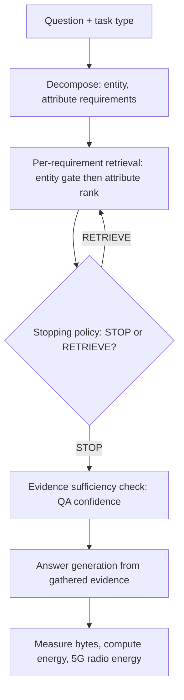

# EcoBudget Developer Documentation

Everything a new developer needs to understand, run, extend, and reproduce the
`ml_retriever` workstream. Every statement here is traceable to code in the repo
or to committed results; anything not directly verifiable is flagged. File
references use `path:line` where useful.

Last verified: 2026-09-17, on branch `teammate-1-ml-retriever`.

## Table of contents

1. [Overview](#1-overview)
2. [Architecture](#2-architecture)
3. [Setup](#3-setup)
4. [Data](#4-data)
5. [Models and training](#5-models-and-training)
6. [Evaluation and experiments](#6-evaluation-and-experiments)
7. [Energy model](#7-energy-model)
8. [Testing](#8-testing)
9. [Reproducibility](#9-reproducibility)
10. [Project status and roadmap](#10-project-status-and-roadmap)
11. [Glossary](#11-glossary)

---

## 1. Overview

EcoBudget is a research prototype for **task-sufficient web loading**: given a
question, load only as much web evidence as the question actually needs, stop as
soon as the evidence is sufficient, and measure the bytes and energy saved on a 5G
access path. The target is a 5G-green research paper.

The repository has three workstreams. This document covers `ml_retriever/`, the
reproducible machine-learning system. The other two are `backend/` (an earlier
FastAPI + Playwright prototype that fetches real pages and estimates CO2e; we
reuse its fetched pages under `backend/pages/` to ground the energy model) and
`frontend/` (the landing page).

**Core claim (measured, frozen test set, n=124 headline tasks):** task-sufficient
adaptive stopping reaches 0.895 answer success / 0.944 fact-F1 at about 106 bytes
per query, versus 420 bytes for full-page loading (about 75 percent fewer bytes)
at statistically equal success, and it dominates fixed-budget and full-page
baselines on bytes, transfer energy, and 5G radio energy (all bootstrap CIs
exclude zero). See [Section 6](#6-evaluation-and-experiments) and
`docs/eval_notes.md`.

**Constraint:** local models only. No hosted LLM API is used anywhere; this is
enforced by `scripts/check_no_llm_api.py` and `tests/test_no_llm_api.py`.

---

## 2. Architecture

One query flows through the pipeline as follows:

```
question
  |
  v
[decompose]            decomposer.py: flan-t5-base + LoRA -> (entity, attribute) requirements
  |                                    attribute snapped to a closed 35-slug vocabulary
  v
[per-requirement       retriever.py: EntityAwareRetriever
 retrieval loop]         gate to entity -> rank by attribute -> ranked candidates
  |   ^
  |   |  STOP / RETRIEVE (after each step)
  v   |
[stopping policy]      bandit.py + rollout.py: BanditPolicy / LinUCB / LinTS / heuristic
  |                     reward = marginal coverage - lambda * byte cost
  v
[evidence sufficiency] evidence.py: EvidenceCoverageTracker + QAScorer (RoBERTa QA confidence)
  |
  v
[answer]               answer.py: flan-t5-base + LoRA, one call per requirement, abstain path
  |
  v
[measure]              energy.py: compute FLOPs + 5G per-bit transfer + RRC radio energy
```

Mermaid version of the same flow:



**Module roles (`ml_retriever/`):**

| module | role |
|---|---|
| `types.py` | Core dataclasses: `Requirement(entity, attribute, value)`, `Passage`, `AnswerResult`. |
| `interfaces.py` | Protocols (`EvidenceTracker`, `AnswerGenerator`) that later phases implement against. |
| `fetching.py` | The fetch contract between this ML workstream and a web/fetch layer (interface only). |
| `decomposer.py` | Phase 2. `TaskDecomposer`: question to requirements; `snap_attribute` constrained decoding over the closed vocabulary. |
| `retriever.py` | Phase 3/D. `rank_passages` (pure ranking math), `RequirementRetriever` (bi-encoder), `EntityAwareRetriever` (gate to entity then rank by attribute, `retriever.py:204`), `passage_matches_entity` (`retriever.py:188`). |
| `evidence.py` | Phase 4. `EvidenceCoverageTracker`, `QAScorer` (RoBERTa QA confidence), `CachedScorer`. |
| `bandit.py` | Phase 5/E. `BanditPolicy` (per-action SGD, `bandit.py:95`), `LinUCBPolicy` (`bandit.py:178`), `LinTSPolicy` (`bandit.py:229`), `compute_reward` (`bandit.py:57`), `featurize`, `FeatureNormalizer`. `STOP=0`, `RETRIEVE=1`. |
| `rollout.py` | Phase 5 episode environment. `run_episode` (`rollout.py:133`, `reward_mode` terminal or per_step), `build_candidates`, `EpisodeState`, and every decider: `decide_full`, `decide_one_per_req`, `decide_heuristic` (`rollout.py:245`), `decide_adaptive_rag` (`rollout.py:263`), `make_fixed_budget_decider`, `make_byte_budget_decider`. |
| `answer.py` | Answer generators: `GenerativeAnswerGenerator` (flan-t5 + LoRA, abstain), `EvidenceAnswerGenerator` (fast, judge-based, used in training sweeps), `ExtractiveQAAnswerGenerator`. |
| `judge.py` | Answer-type-aware judges, symmetric `_normalize`, `judge_task` returning `(judge_success, fact_f1)`. |
| `energy.py` | Phase A/B/F. `ComputeModel`, `FiveGTransferModel`, `PayloadModel`, `RadioStateModel` (`energy.py:185`), `EnergyAccountant`, `query_op_counts`. |
| `system.py` | Phase 6. `EcoBudgetSystem`: the end-to-end deployed path wiring all components together. |

Every component is dependency-injected, so its core logic is unit-tested without
downloading a model (see [Section 8](#8-testing)).

---

## 3. Setup

Python 3.10+ (the committed venv uses 3.13.7). Apple Silicon uses the torch MPS
backend automatically; a CUDA GPU is much faster for training.

```bash
cd ml_retriever
python -m venv .venv
source .venv/bin/activate            # Windows: .venv\Scripts\activate
pip install -e ".[dev,train]"
```

Dependencies (`pyproject.toml`): sentence-transformers, transformers, torch,
spacy, scikit-learn, xgboost, joblib, numpy; the `train` extra adds peft and
datasets; the `dev` extra adds pytest and pytest-cov.

**Local-models-only guard.** The project must never import a hosted-LLM-API client
(openai, anthropic, etc.) or call a known API host. Enforced by:

```bash
python scripts/check_no_llm_api.py       # scans ml_retriever/ and scripts/
```

and run automatically inside `tests/test_no_llm_api.py`.

**Model checkpoints.** Trained checkpoints under `models/` are gitignored (they
are large). A fresh clone has no checkpoints; regenerate them with the training
commands in [Section 5](#5-models-and-training). The frozen pretrained models
(MiniLM, RoBERTa-QA) are downloaded from Hugging Face on first use.

---

## 4. Data

All data lives in `data/`. Core schema (`ml_retriever/types.py`):

- `Requirement(entity: str, attribute: str, value: Optional[str])` -- one
  information need, keyed by `(entity, attribute)`; `value` is used only in
  evaluation, never by retrieval or stopping.
- `Passage(passage_id, text, byte_size, source_url, embedding, metadata)` -- a
  retrievable evidence snippet. Corpus passages carry
  `metadata = {entity, attribute}` and a 384-dim MiniLM `embedding`.
- `AnswerResult(answer, confidence, used_evidence_ids, abstained, generator_version)`.

**Current sizes (verified 2026-09-17):**

| file | contents |
|---|---|
| `data/corpus.jsonl` | 186 passages, all embedded (384-dim). Domains: phones, laptops, electronics, travel, buildings, geography, countries, running shoes, EVs, earbuds, mountains. |
| `data/tasks.json` | 1,376 tasks: 344 hand-authored seeds + templated synthetic paraphrases. Types: single_fact, comparison, yes_no, multi_part, list, narrative, procedure. |
| `data/splits.json` | train 1,008 / val 240 / test 128 (sum 1,376). Frozen. |
| `data/measured_payloads.json` | measured real page sizes: median HTML 506,179 B over 19 real pages (used by `PayloadModel.html_page_bytes`). |

**Seed to synthetic to split pipeline.** Seeds are hand-written; synthetic tasks
are templated paraphrases that preserve the seed's requirements and gold.
`scripts/make_splits.py` splits at the **seed level**, so every paraphrase of a
seed lands in the same split as its seed (this closes a leakage hole where
near-duplicate wording could appear in both train and test). A coverage invariant
(also enforced in `tests/test_data.py`) guarantees every answer type and attribute
slug appears in train; `procedure` is the one documented exception, since its
single seed is reserved for the frozen test split.

**Frozen-split discipline.** The split is frozen. The final test set is run
exactly once, at the very end (see `phase7_experiment.py --split test`). Do not
regenerate or edit `data/splits.json` outside a deliberate re-cut.

**Regeneration command chain** (run in this order; the committed `data/` already
holds the frozen artifacts, so skip steps 1-2 to match the exact numbers):

```bash
# 1. corpus + tasks + scale-up + curated gold
python scripts/build_seed_corpus.py
python scripts/build_seed_tasks.py
python scripts/expand_dataset_phase_c.py
python scripts/generate_synthetic_tasks.py
python scripts/curate_gold.py
# 2. splits + per-model training data
python scripts/make_splits.py
python scripts/build_decomposer_training_data.py
python scripts/build_answer_training_data.py          # add --noise_aug 2 for the robust answerer
# 3. embeddings + measured payloads
python scripts/embed_corpus.py
python scripts/measure_real_pages.py
```

Other data scripts: `expand_seed_tasks.py`, `build_structured_gold.py`, and
`validate_corpus_task_coverage.py` (integrity check).

---

## 5. Models and training

Three fine-tuned models (all LoRA on flan-t5-base) and two frozen pretrained
models. Checkpoints live under `models/` (gitignored).

**Decomposer -> `models/decomposer-base-lora`.**
flan-t5-base, LoRA r=32 alpha=64 target modules q,v,k,o, 20 epochs, lr 5e-4, on
1,008 train pairs. About 15 hours on the shared Apple Silicon laptop, final eval
loss ~0.015. Re-measured on the current 240-example val split (2026-09-17):
exact-match 0.892, entity-EM 0.946, per-requirement F1 0.936, entity_f1 0.979,
attribute_f1 0.969 (`docs/eval_notes.md`, Decomposer CURRENT metrics). The
0.75 figure elsewhere is the historical Phase 2 model and is superseded.

```bash
python scripts/train_decomposer.py --model google/flan-t5-base \
    --output_dir models/decomposer-base-lora --epochs 20 --lora \
    --lora_r 32 --lora_alpha 64 --lr 5e-4 --lora_target_modules q,v,k,o
```

**Answerer -> `models/answer-base` (the reported model).**
flan-t5-base + LoRA, 12 epochs, 968 train pairs, about 24 minutes. Called once per
requirement with an abstain path.

```bash
python scripts/train_answer_generator.py --model google/flan-t5-base \
    --output_dir models/answer-base --epochs 12 --lora
```

There is also `models/answer-base-robust` (2,904 rows = 968 clean + 1,936
noise-augmented, 10 epochs). It fixed the verbose spec-dump failure mode on live
pages but did NOT fix answer correctness there, so it is NOT adopted; see
[Section 10](#10-project-status-and-roadmap).

**Stopping policy -> `models/bandit_policy.joblib` + `models/bandit_normalizer.joblib`.**
Per-action linear SGD classifier, per-step reward, lambda 0.5 (selected by a
pre-registered sweep). Verified healthy (final-epoch reward +0.877; today's Phase 7
reproduces the reported behavior, not a collapse).

```bash
python scripts/train_bandit.py --epochs 8 --lam 0.5 --reward_mode per_step
```

**External baselines -> `models/linucb_policy.joblib`, `models/lints_policy.joblib`.**
LinUCB (alpha=1.0) and linear Thompson sampling (v=0.25), trained under identical
conditions (same features, reward, normalizer, candidates).

```bash
python scripts/train_baselines.py --epochs 8 --lam 0.5
```

**Deployed policy (Phase G): LinUCB is the default.** As of Phase G, the deployed
path (`run_pipeline.py`) defaults to `--policy linucb` because it is stable across
seeds (multi-seed 0.913 +/- 0.007) whereas the SGD bandit is not (0.790 +/- 0.283);
on the frozen test set they tie within noise. `--policy bandit` and `--policy lints`
remain selectable. See `docs/phase_g_consolidation.md`.

**Frozen pretrained (not trained):** `sentence-transformers/all-MiniLM-L6-v2`
(query and corpus embeddings) and `deepset/roberta-base-squad2` (evidence
sufficiency scorer in `evidence.py`).

---

## 6. Evaluation and experiments

**Two metrics, reported separately** (`judge.py`): `judge_success` is binary (every
required fact matched after normalization) and `fact_f1` is the fraction of
required facts matched. The normalizer is symmetric and covers case, whitespace,
`$`/comma stripping, number-unit spacing, trailing `.0`, and leading articles; it
does not cover synonyms or unit conversion.

| script | measures | run |
|---|---|---|
| `eval_retriever.py` | recall@k for whole-question vs per-requirement vs entity-aware retrieval on 175 unique seed requirements | `python scripts/eval_retriever.py --k 1` (and `--k 5`) |
| `eval_bandit.py` | the trained bandit vs baselines on val | `python scripts/eval_bandit.py` |
| `sweep_lambda.py` | the byte-penalty lambda sweep and the collapse cliff | `python scripts/sweep_lambda.py --epochs 8 --lams 0.1 0.25 0.5 1 2 4` |
| `phase7_experiment.py` | the main experiment: success, fact_f1, bytes, actions, latency, compute/transfer/radio energy, payload sensitivity, per-type breakdown, and paired bootstrap CIs, for all 11 conditions | `python scripts/phase7_experiment.py --n 100 --split val` |
| `retrieval_noise_sweep.py` | pre-registered: when adaptivity beats the heuristic as retrieval noise rises | `python scripts/retrieval_noise_sweep.py --epochs 8 --noises 0 0.1 0.2 0.4 0.6` |
| `multiseed.py` | policy-training variance across seeds (bandit, LinUCB, LinTS) | `python scripts/multiseed.py --seeds 0 1 2 3 4 --epochs 8 --lam 0.5` |
| `ablate_reward.py` | Phase G ablation: per-step vs terminal reward mode (val, multi-seed) | `python scripts/ablate_reward.py --seeds 0 1 2 --lam 0.5` |
| `eval_decomposer.py` | decomposer exact-match / entity-EM / F1 on val (add `--no_attr_snap` for the snap ablation) | `python scripts/eval_decomposer.py --model_path models/decomposer-base-lora --adapter_path models/decomposer-base-lora` |
| `radio_sensitivity.py` | robustness of the radio-energy finding across cited coefficient ranges | `python scripts/radio_sensitivity.py` |
| `end_to_end_web.py` | full pipeline on real live pages: measured byte and energy savings | `python scripts/end_to_end_web.py` |
| `make_figures.py` | the four paper figures from the frozen-test results | `python scripts/make_figures.py` |

**Reading `phase7_experiment.py` output.** The headline table restricts to
`HEADLINE_TYPES = {comparison, single_fact, multi_part, yes_no}` (`phase7_experiment.py:39`),
i.e. types with n>=3, excluding `procedure`. The per-condition JSON top-level
(`data/phase7_results*.json`) aggregates over ALL types (so its success is lower,
because it includes the failing `procedure` tasks). The figures use the headline
subset to match the tables (`make_figures.py`, `HEADLINE_TYPES`). Bootstrap CIs
are paired, 2000 resamples (`bootstrap_ci`, `phase7_experiment.py:92`).

**Headline results (frozen test, n=124):** bandit 0.895 / fact_f1 0.944 / 106 B /
1.84 fetches; LinUCB 108 B; heuristic 136 B; one_per_req 0.831 / 101 B; full
0.903 / 420 B. Bandit vs full: bytes -314 [-350,-282], net energy at measured
page scale -66.3 J [-95.1,-40.8], radio -2.05 J [-2.17,-1.92]. Bandit vs
one_per_req: success +0.065 [+0.024,+0.113]. Retriever: recall@1 0.914 -> 0.989,
recall@5 0.983 -> 1.000. Multi-seed: SGD bandit 0.790 +/- 0.283 (unstable),
LinUCB 0.913 +/- 0.007, heuristic 0.917. (Source: `docs/eval_notes.md`,
`data/phase7_results_test.json`.)

---

## 7. Energy model

Full detail and every coefficient with its source is in `docs/energy_model.md`.
Summary:

- **Compute** (`ComputeModel`): inference FLOPs ~= 2 * params * tokens per forward
  pass, divided by device efficiency (default 5e10 FLOPS/J, edge-CPU class).
- **5G transfer** (`FiveGTransferModel`): energy per bit split RAN + transport +
  device modem receive; `network_j_per_bit = 2.25e-5`, `device_rx_j_per_bit = 4.0e-7`.
- **Payloads** (`PayloadModel`): four realism scenarios -- text (extracted bytes),
  resource (text x4, floor 800 B), html_page (measured median 506 KB,
  `energy.py:162`), full_page (2 MB assumption). Page scenarios de-duplicate by
  `source_url`.
- **Radio** (`RadioStateModel`, `energy.py:185`, Phase F/Tier B): RRC promotion +
  active span + inactivity tail, with cited 5G/LTE coefficients (Narayanan
  SIGCOMM 2021; Huang MobiSys 2012; 3GPP TS 38.331) and a fast-dormancy
  sensitivity toggle.
- **Carbon**: gCO2e via grid intensity 475 gCO2e/kWh (IEA global-average; the
  backend uses 494, the SWD default -- documented, same order).

Key finding: compute dominates transfer by ~100x at snippet scale, but at the
measured real page scale transfer dominates (about 95 percent of total energy), so
loading fewer pages is the primary lever. The adaptive policy wins in both regimes.

---

## 8. Testing

```bash
source .venv/bin/activate
python -m pytest -q          # 172 tests, ~1 second, no downloads
```

**Model-free convention.** Tests use dummy embeddings and stubbed encoders, so no
test downloads a model. Where a class lazily loads a model (retriever, decomposer,
answerer), the pure math (`rank_passages`, `passage_matches_entity`, reward,
normalizer, energy) is what the tests exercise; model encoding is verified by the
eval scripts on a machine with the models.

**Coverage (14 test files):** `test_types`, `test_interfaces`, `test_data` (data
integrity + split invariants), `test_decomposer`, `test_retriever` (ranking +
entity gate), `test_evidence`, `test_bandit` (SGD + LinUCB + LinTS), `test_rollout`,
`test_answer`, `test_system`, `test_judge`, `test_eval_metric`, `test_energy`
(compute, transfer, payloads, radio), `test_no_llm_api` (the guard).

---

## 9. Reproducibility

To reproduce the headline numbers from the committed data (skip data rebuild):

```bash
source .venv/bin/activate
# 1. embeddings + measured payloads (needs network for MiniLM)
python scripts/embed_corpus.py
python scripts/measure_real_pages.py
# 2. train (decomposer is ~15h on MPS; others are minutes)
python scripts/train_decomposer.py --model google/flan-t5-base \
    --output_dir models/decomposer-base-lora --epochs 20 --lora \
    --lora_r 32 --lora_alpha 64 --lr 5e-4 --lora_target_modules q,v,k,o
python scripts/train_answer_generator.py --model google/flan-t5-base \
    --output_dir models/answer-base --epochs 12 --lora
python scripts/train_bandit.py --epochs 8 --lam 0.5 --reward_mode per_step
python scripts/train_baselines.py --epochs 8 --lam 0.5
# 3. evaluate
python scripts/eval_retriever.py --k 1
python scripts/eval_retriever.py --k 5
python scripts/phase7_experiment.py --n 100 --split val
python scripts/multiseed.py --seeds 0 1 2 3 4 --epochs 8 --lam 0.5
# 4. the single frozen test run (run ONCE, after configs are locked)
python scripts/phase7_experiment.py --n 200 --split test
python scripts/make_figures.py
# 5. Phase G ablations (optional, consolidated in docs/phase_g_consolidation.md)
python scripts/ablate_reward.py --seeds 0 1 2 --lam 0.5
python scripts/eval_decomposer.py --model_path models/decomposer-base-lora \
    --adapter_path models/decomposer-base-lora --no_attr_snap   # snap ablation
```

The full reproducibility appendix (exact commands, seeds, versions, checkpoint
locations) is `docs/reproducibility.md`; the consolidated ablation table,
multi-seed variance, and frozen test run are in `docs/phase_g_consolidation.md`.

Seeds: bandit / baselines / multiseed default to seed 0; multiseed sweeps 0-4.
Note the training-time caveat: on the shared laptop, running a heavy training job
and Phase 7 concurrently causes MPS/CPU contention that slows Phase 7 by orders of
magnitude (this caused an apparent 10-hour Phase 7 that ran in ~2.5 minutes once
the machine was free). Run them sequentially.

---

## 10. Project status and roadmap

Phases are defined in `docs/roadmap_5g_green.md` (`## Phase A` ... `## Phase H`).

| phase | goal | status |
|---|---|---|
| A | Compute vs transfer energy accounting | done |
| B | Defensible 5G energy model + realistic payloads | done (payloads later grounded in measured real pages) |
| C | Dataset scale-up | done (186 passages, 344 seeds, 1,376 tasks) |
| D | Entity-aware retriever | done (recall@1 0.914 -> 0.989, recall@5 -> 1.000) |
| E | External and standard baselines | done (LinUCB, LinTS, Adaptive-RAG analog) |
| F | Radio-state / latency energy | done (RRC model + cited coefficients + sensitivity) |
| G | Rigor, reproducibility, final test run | done: multi-seed variance, consolidated ablation table, frozen test run, and the reproducibility appendix are all written (`docs/phase_g_consolidation.md`, `docs/reproducibility.md`). LinUCB is now the deployed default policy. Answerer multi-seed was skipped as a stated resource limitation (~3.5 h per fine-tune). |
| H | Paper assembly | not started |

### Phase G consolidation summary (`docs/phase_g_consolidation.md`)

The consolidated ablations, each isolating one design choice on val:

| ablation | result |
|---|---|
| retriever | recall@1 0.589 (whole-question) -> 0.914 (per-req) -> 0.989 (entity-aware) |
| decomposer snap | exact-match 0.496 (off) -> 0.892 (on); entity-EM unchanged 0.946 (snap is attribute-only) |
| byte-penalty lambda | 0.917 success at lambda<=0.5, collapses to 0.283 at lambda>=1.0 (cliff between 0.5 and 1.0) |
| reward mode | per-step 0.706 +/- 0.366 @ 90 B vs terminal 0.989 +/- 0.019 @ 256 B (terminal over-retrieves ~3x; per-step lean but high-variance) |
| answer mode (Phase 6) | joint 0.375 vs per-requirement 0.750 comparison success |

Multi-seed (5 seeds): SGD bandit 0.790 +/- 0.283, LinUCB 0.913 +/- 0.007, LinTS
0.897 +/- 0.014, heuristic 0.917. LinUCB is the reported and deployed policy.

### Known issues and limitations (candid)

- **The SGD bandit is not the contribution and is seed-unstable.** Across five
  seeds it is 0.790 +/- 0.283 (it collapses on some seeds), while LinUCB
  (0.913 +/- 0.007) and the heuristic (0.917) are stable. The saved
  `bandit_policy.joblib` is a good seed. RESOLVED in Phase G: LinUCB is now the
  deployed default policy (`run_pipeline.py --policy linucb`), and it is the
  reported learned policy; the SGD bandit is retained as an ablation, selectable
  via `--policy bandit`. The contribution is the task-sufficiency framework plus
  the 5G energy/radio characterization, not a new bandit algorithm. See the
  `bandit-retriever-tension` memory, `docs/phase_g_consolidation.md`, and
  `docs/eval_notes.md`.
- **Reward-mode tradeoff (Phase G ablation).** Under the entity-aware retriever
  the two reward modes trade off: terminal credit reaches high success
  (0.989 +/- 0.019) but over-retrieves (about 3x the bytes, 256 vs 90) because
  coarse episode credit does not penalize a wasteful RETRIEVE, while per-step is
  byte-lean but high-variance (0.706 +/- 0.366) - the same SGD instability. This
  is a further reason the reported policy is LinUCB, not the per-step SGD bandit.
- **Lambda recalibration after Phase D.** The entity-aware retriever shrank the
  per-query byte scale, so the old lambda 4.0 (tuned against the old retriever)
  over-penalized retrieval and the policy collapsed to always-STOP. A
  pre-registered re-sweep selected lambda 0.5. Above ~0.5 the policy still
  collapses; this is validation-only selection, test stayed frozen.
- **Bandit ties, does not beat, the heuristic under the strong retriever.** With
  recall@1 0.989 there is little uncertainty left to exploit; the learned policy
  converges to the heuristic (difference 0, CI [0,0]). Its edge over the heuristic
  grows with retrieval uncertainty (characterized in `retrieval_noise_sweep.py`).
- **Retriever attribute-confusion ceiling.** Two recall@1 misses remain, both
  same-entity semantic near-synonyms with gold at rank 2 (Empire State Building
  `completion_year`, Kyoto `best_time_to_visit`). Not worked around.
- **Corpus-to-web domain gap.** On raw live pages the pipeline has no
  (entity, attribute) metadata, so it selects the wrong attribute from coarse
  chunks and answers incorrectly (e.g. iPhone refresh rate -> `1280p`). The
  noise-augmented answerer fixed the verbose-dump formatting but not correctness;
  the real fix is per-entity live fetching with structured extraction. Byte and
  energy savings are unaffected.
- **Narrative and procedure tasks have no train coverage and fail.** They are
  excluded from the headline metrics (n>=3, procedure excluded) and reported as a
  gap.
- **Reruns and file hygiene.** A chained rerun once left `phase7_results.json` and
  `phase7_results_test.json` identical (val overwritten by test); restored so the
  val file holds val and the test file holds test. `run_pipeline.py` previously
  defaulted `--answerer` to a stale `models/answer-small`; corrected to
  `answer-base`. The figures previously used the all-types aggregate; corrected to
  the headline subset. (All fixed 2026-09-17.)
- **Energy is a first-order model,** FLOPs-and-per-bit with cited coefficients and
  reported sensitivity ranges, not a hardware power measurement.

---

## 11. Glossary

- **Task sufficiency** -- loading only as much evidence as the question needs, then
  stopping; the project's central idea.
- **Requirement / (entity, attribute)** -- one atomic information need, e.g.
  (iPhone 16, price). The unit of decomposition, retrieval, and coverage.
- **Snap-to-vocab** -- constrained decoding: the decomposer's generated attribute
  is snapped to the nearest slug in the closed 35-attribute vocabulary (exact
  normalized match, else Levenshtein within a threshold). Attribute-only; entities
  are never snapped (`decomposer.py`).
- **Entity dominance** -- failure mode where the entity name dominates the query
  embedding, so retrieval returns a near-twin entity (S24 vs S24 Ultra). Fixed by
  the entity gate.
- **Attribute confusion** -- correct entity, wrong attribute retrieved (Empire
  State height vs floors). Reduced by ranking on the attribute phrase within the
  gate; a small residual remains.
- **Per-step reward vs terminal reward** -- per-step credits each RETRIEVE with the
  marginal coverage it adds minus its byte cost and each STOP with realized
  success; terminal credits every step the whole-episode objective. Per-step lets
  the policy tell a premature STOP from a wasteful RETRIEVE (`rollout.py:144`).
- **lambda (byte penalty)** -- weight on the byte cost in the reward
  (`compute_reward`, `bandit.py:57`). Selected at 0.5 by a pre-registered sweep;
  above ~0.5 the policy collapses to always-STOP under the entity-aware retriever.
- **Oracle gap** -- the accuracy difference between feeding the pipeline the gold
  evidence passages versus letting it retrieve; it isolates retrieval loss from
  answering loss.
- **Headline types** -- the reported evaluation subset {comparison, single_fact,
  multi_part, yes_no} (n>=3, procedure excluded), matched across the tables and the
  figures.
- **Fast-dormancy tail energy** -- 5G radio energy sensitivity where the modem
  releases aggressively between fetches, so each fetch pays its own promotion and
  tail; this magnifies the advantage of issuing fewer fetches (`RadioStateModel`).
- **judge_success vs fact_f1** -- binary all-facts-matched vs continuous fraction
  of facts matched; reported separately.
</content>
